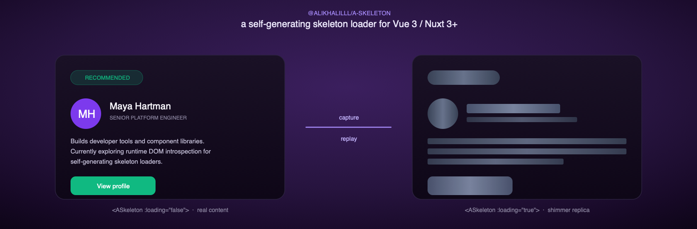

# `@alikhalilll/a-skeleton`

> A self-generating skeleton loader for Vue 3 / Nuxt 3+.
> Three rendering strategies (clone, mirror, structural) · pixel-identical computed-style snapshot ·
> per-line text geometry via `Range` API · 15 named variants · themeable via CSS variables · SSR-safe mirror mode.

<p align="center">
  
</p>

<p align="center">
  <sub>One wrapper, three engines — clone (default, pixel-identical) · mirror (SSR-safe) · structural (normal flow).</sub>
</p>

[](https://www.npmjs.com/package/@alikhalilll/a-skeleton)
[](./LICENSE)
[](https://www.npmjs.com/package/@alikhalilll/a-skeleton)

## Setup

### Nuxt 3 / 4

```bash
pnpm add @alikhalilll/a-skeleton
# npm install @alikhalilll/a-skeleton
# yarn add @alikhalilll/a-skeleton
# bun add @alikhalilll/a-skeleton
```

```ts
// nuxt.config.ts
export default defineNuxtConfig({
  modules: ['@alikhalilll/a-skeleton/nuxt'],
  css: ['@alikhalilll/a-skeleton/styles.css'],
});
```

`<ASkeleton>`, `<ASkeletonLayer>`, `<ASkeletonBlock>`, and all variant primitives (`<ASkeletonCard>`, `<ASkeletonText>`, …) are auto-imported — no `import` statement needed in your `.vue` files.

### Vue + Vite

```bash
pnpm add @alikhalilll/a-skeleton
```

```ts
// main.ts
import '@alikhalilll/a-skeleton/styles.css';
```

Optional auto-resolve via `unplugin-vue-components`:

```ts
// vite.config.ts
import Components from 'unplugin-vue-components/vite';
import ASkeletonResolver from '@alikhalilll/a-skeleton/resolver';

export default { plugins: [Components({ resolvers: [ASkeletonResolver()] })] };
```

---

## Why this component

- **Self-generating** — wrap your real component and the engine derives the placeholder from the slot you're already rendering. No hand-drawn shimmer markup, no parallel "loading state" templates to maintain.
- **Three rendering strategies, one wrapper** — `mode="clone"` (default) snapshots `getComputedStyle()` for pixel-identical replay regardless of styling pipeline; `mode="mirror"` walks the vnode tree for SSR-safe placeholders; `useSkeleton()` + `<ASkeletonLayer>` for structural / normal-flow skeletons that reflow with their parent.
- **Comprehensive surface capture** — per-edge borders, per-corner radii, background colour + image, box-shadow, opacity, filter, transform, mix-blend-mode, typography — every visible CSS property carries through so the skeleton reads as the real element, not as a generic shimmer.
- **Per-line text geometry** — `Range.getClientRects()` captures the exact rendered text rect of every line. Wrapped paragraphs, centred multi-line headings, and RTL last-line positions replay 1:1 — no heuristics.
- **15 named variants** — `<ASkeletonCard>`, `<ASkeletonText>`, `<ASkeletonHeading>`, `<ASkeletonAvatar>`, `<ASkeletonImage>`, `<ASkeletonVideo>`, `<ASkeletonButton>`, `<ASkeletonInput>`, `<ASkeletonChip>`, `<ASkeletonListItem>`, `<ASkeletonTable>`, `<ASkeletonChart>`, `<ASkeletonForm>`, `<ASkeletonArticle>`, `<ASkeletonDivider>`. Each accepts `class` / inline `style` and shares the same animation + theming pipeline.
- **Bounded cost** — every walker enforces `maxDepth` / `maxNodes` / `minSize`. A 5 000-row table will not lock up the main thread. Captured nodes carry frozen pre-computed styles so the render loop is allocation-free.
- **Themeable via CSS variables** — `--ak-skel-base`, `--ak-skel-highlight`, `--ak-skel-radius`, `--ak-skel-duration`, `--ak-skel-pulse-min`, `--ak-skel-ring`, `--ak-skel-icon`. Override on `:root`, a wrapper class (multi-tenant), or inline.
- **Empty-interpolation aware** — `<h3>{{ data?.name }}</h3>` with null data still shimmers at the heading's natural rendered height. Both `mode="clone"` and `mode="mirror"` classify empty text-owner tags (`<h1>`-`<h6>`, `<p>`, `<span>`, …) as text bars rather than generic blocks.
- **`prefers-reduced-motion`** disables animation automatically.
- **SSR-safe (mirror)** — no `window` access during the structural pass; hydration is clean.
- **TypeScript-first** — every prop, slot, type, and composable fully typed; web-types ship for JetBrains IDEs.

---

## Table of contents

- [Setup](#setup)
- [Quick start](#quick-start)
- [Three rendering strategies](#three-rendering-strategies)
  - [Clone (default)](#clone-default)
  - [Mirror](#mirror)
  - [Structural / normal-flow](#structural--normal-flow)
- [Authoring rule](#authoring-rule)
- [API reference](#api-reference)
  - [`<ASkeleton>` props](#askeleton-props)
  - [Slots](#slots)
  - [DOM escape hatches](#dom-escape-hatches)
  - [Variant primitives](#variant-primitives)
  - [`<ASkeletonBlock>`](#askeletonblock)
  - [`<ASkeletonLayer>`](#askeletonlayer)
  - [Composables](#composables)
  - [Pure utilities](#pure-utilities)
  - [Cache primitives](#cache-primitives)
- [Theming](#theming)
  - [CSS custom properties](#css-custom-properties)
  - [Multi-tenant + dark mode](#multi-tenant--dark-mode)
- [Animations](#animations)
- [Accessibility](#accessibility)
- [Performance](#performance)
- [SSR](#ssr)
- [TypeScript](#typescript)
- [Browser support](#browser-support)
- [Troubleshooting](#troubleshooting)
- [License](#license)

---

## Quick start

```vue
<script setup lang="ts">
import { ref, computed } from 'vue';

const user = ref(null);
const loading = computed(() => user.value === null);

async function load() {
  user.value = await fetch('/api/me').then((r) => r.json());
}
load();
</script>

<template>
  <ASkeleton :loading="loading">
    <!-- Keep TAGS unconditional (the walker sees the same shape in both
         states); gate per-leaf CONTENT via interpolation. -->
    <div class="flex items-start gap-4 p-4">
      
      <div class="flex-1">
        <h3 class="text-base font-semibold">{{ user?.name }}</h3>
        <p class="text-sm leading-relaxed">{{ user?.bio }}</p>
      </div>
    </div>
  </ASkeleton>
</template>
```

That's the whole API for most cases. Every layer underneath is also a public export — see the recipes below.

---

## Three rendering strategies

Pick the one that matches how your styles get to the DOM:

| Strategy              | Surface                              | How geometry is derived                                                                                                                                                                         | Best when                                                                                                                   |
| --------------------- | ------------------------------------ | ----------------------------------------------------------------------------------------------------------------------------------------------------------------------------------------------- | --------------------------------------------------------------------------------------------------------------------------- |
| **Clone** _(default)_ | `<ASkeleton :loading>`               | Mounts the slot off-screen, snapshots every leaf's **computed style** via `getComputedStyle()`, replays as positioned divs each carrying its captured inline CSS.                               | Styles come from any pipeline — class names, inline `style`, CSS-in-JS, scoped styles. Pixel-identical. Client-side only.   |
| **Mirror**            | `<ASkeleton mode="mirror" :loading>` | Walks the slot's **vnode** tree at render time. Preserves every tag and `class`; leaves become shimmer bars.                                                                                    | SSR-safe placeholders (no DOM read needed) or when the static class is enough to drive the surface.                         |
| **Structural**        | `useSkeleton()` + `<ASkeletonLayer>` | Walks the real **DOM** tree, preserves container tags + classes + layout CSS (`display`, `flex-*`, `grid-*`, `gap`, `padding`), replaces leaves with `<div class="a-skel">` in **normal flow**. | You want the skeleton to reflow with its parent, or you're orchestrating cache + capture outside a single wrapper instance. |

All three share one cache module, one theming surface, and the same a11y baseline.

### Clone (default)

The slot mounts off-screen inside a `visibility: hidden` capture host. After mount, `captureSnapshot()` reads `getComputedStyle()` for every element under the host — capturing the **final** background, per-edge border, per-corner radius, box-shadow, padding, opacity, filter, transform, typography — plus per-line text rects via `Range.getClientRects()`. `<ASkeletonClone>` then replays the snapshot as a tree of positioned divs each carrying its captured inline style.

```vue
<ASkeleton :loading="loading">
  <SomeRichComponent />
</ASkeleton>
```

The capture API is a public export — power-users can roll their own capture / replay flow:

```ts
import { captureSnapshot, type CaptureSnapshot } from '@alikhalilll/a-skeleton';

const snap: CaptureSnapshot = captureSnapshot(myRootEl, {
  maxDepth: 12,
  maxNodes: 800,
  minSize: 4,
});
```

### Mirror

Switch to `mode="mirror"` when you need the placeholder on the server, or when your styles already drive the surface correctly from class names alone:

```vue
<ASkeleton mode="mirror" :loading="loading">
  <SomeRichComponent />
</ASkeleton>
```

`buildStructuralSkeleton()` walks the slot's vnode tree at render time, preserves every element with its real `class` / inline `style`, and replaces text-bearing leaves with `<span class="a-skel-text-content">` (transparent text + skeleton background, exact rendered width via `box-decoration-break: clone`). Atomic / interactive tags (``, `<button>`, `<svg>`) become `<div class="a-skel-block">` sized from their original class.

Text-owner tags with empty content (`<h3>{{ data?.name }}</h3>` during loading) auto-shimmer at the heading's natural rendered height — the walker injects a placeholder text-content span so the bar's height tracks the tag's font-size / line-height.

### Structural / normal-flow

For cases where the wrapper isn't your unit of orchestration — caching shapes across instances, persisting between sessions, or wanting the skeleton to reflow with its parent — reach for `useSkeleton()` + `<ASkeletonLayer>`:

```vue
<script setup lang="ts">
import { computed, ref } from 'vue';
import { useSkeleton } from '@alikhalilll/a-skeleton';

const props = defineProps<{ userId: string }>();
const user = ref(null);
const loading = computed(() => user.value === null);
const containerRef = ref<HTMLElement | null>(null);

const { shape, clear } = useSkeleton({
  cacheKey: `user-card:${props.userId}`,
  // While loading, target is null → no capture. When real content mounts,
  // target returns the wrapper → ResizeObserver + capture.
  target: () => (loading.value ? null : containerRef.value),
  persist: true,
});

fetchUser(props.userId).then((u) => (user.value = u));
</script>

<template>
  <div ref="containerRef">
    <ASkeletonLayer v-if="loading && shape" :shape="shape" />
    <ColdStartFallback v-else-if="loading" />
    <UserCard v-else :data="user" />
  </div>
</template>
```

`walkStructural()` produces a frozen tree where containers preserve their tag, original `class`, and captured layout CSS (`display`, `flex-*`, `gap`, `padding`, `grid-*`, `box-sizing`), and leaves carry inline `width` / `height` + visual signals. `<ASkeletonLayer>` replays the tree in **normal flow**, so the skeleton lives inside its parent's layout instead of overlaying it with absolute coordinates — it reflows on viewport resize and never collapses to a flat positioned grid.

Given real markup like:

```html
<div class="flex flex-col gap-4 p-4">
  <h3>…</h3>
  <p>…</p>
  <button>…</button>
</div>
```

…the layer replays as:

```html
<div
  class="flex flex-col gap-4 p-4"
  style="display: flex; flex-direction: column; gap: 16px; padding: 16px; box-sizing: border-box"
>
  <div class="a-skel" style="width: 200px; height: 24px; …" />
  <div class="a-skel" style="width: 280px; height: 16px; …" />
  <div class="a-skel" style="width: 120px; height: 36px; …" />
</div>
```

The original class is preserved so utility-first CSS still applies; the resolved layout CSS is inlined as a fallback so the skeleton looks correct even when the stylesheet isn't at the mount point.

The structural cache lives in its own `localStorage` namespace (`a-skeleton:s:` prefix, schema `v: 3`), so it can never collide on the same `cacheKey` with the flat `CachedShape` cache. Mismatched schema versions auto-purge on read.

---

## Authoring rule

Keep **tags** unconditional; gate per-leaf **content** via interpolation. Two safe patterns:

1. **Always render the same tag**, gate its content.
   - `` renders an `` in both states (walker treats it as atomic → sized shimmer block).
   - `<h3>{{ user?.name }}</h3>` renders an empty `<h3>` during loading and the walker auto-injects a placeholder shimmer bar at the heading's natural width.
2. **Use explicit primitives** with `v-if` / `v-else` (see [`<ASkeletonBlock>`](#askeletonblock) and the [Variant primitives](#variant-primitives)) when the loading and loaded states genuinely have different markup.

The pattern to **avoid** is swapping whole branches (`<div v-else>`). The walker sees one shape now and a different shape later — the skeleton can't predict the placeholder geometry.

---

## API reference

### `<ASkeleton>` props

| Prop          | Type                             | Default            | Description                                                                                                                                                                                                                                      |
| ------------- | -------------------------------- | ------------------ | ------------------------------------------------------------------------------------------------------------------------------------------------------------------------------------------------------------------------------------------------ |
| `loading`     | `boolean`                        | —                  | When `true`, show the skeleton.                                                                                                                                                                                                                  |
| `mode`        | `'clone' \| 'mirror'`            | `'clone'`          | Rendering strategy. `clone` snapshots `getComputedStyle()`; `mirror` walks the vnode tree (SSR-safe).                                                                                                                                            |
| `cacheKey`    | `string`                         | auto, per-instance | Auto-generated as `<slot-fingerprint>:<useId()>` so each instance has its own slot. Pass explicitly to share a captured shape across instances (e.g. a list of identical cards) or to differentiate prop-variant shapes from the same component. |
| `maxDepth`    | `number`                         | `16`               | Max recursion depth when capturing.                                                                                                                                                                                                              |
| `maxNodes`    | `number`                         | `600`              | Hard cap on captured / structural nodes. Walks bail beyond this with `truncated: true` and a one-time `console.warn` per `cacheKey`.                                                                                                             |
| `minNodeSize` | `number`                         | `4`                | Skip elements smaller than this many CSS pixels (either axis). Drops hairlines / spacer dots.                                                                                                                                                    |
| `persist`     | `boolean`                        | `false`            | Mirror captured shape to `localStorage`. Schema-versioned; entries from older releases auto-purge on read.                                                                                                                                       |
| `animation`   | `'shimmer' \| 'pulse' \| 'none'` | `'shimmer'`        | Animation variant. `prefers-reduced-motion` disables animation automatically.                                                                                                                                                                    |
| `fallback`    | `'shimmer' \| 'block'`           | `'shimmer'`        | Default cache-miss UI when no `#fallback` slot is provided (mirror mode only).                                                                                                                                                                   |
| `class`       | `HTMLAttributes['class']`        | —                  | Class on the outer wrapper.                                                                                                                                                                                                                      |

### Slots

| Slot       | Description                                                                                    |
| ---------- | ---------------------------------------------------------------------------------------------- |
| `default`  | The real content. Rendered when `loading` is false; measured / mirrored to build the skeleton. |
| `fallback` | Custom UI for cache misses (mirror mode). Defaults to a single full-width shimmer block.       |

### DOM escape hatches

Mark elements during the walk via data attributes — applies to all three strategies:

| Attribute              | Effect                                                                                                                                                     |
| ---------------------- | ---------------------------------------------------------------------------------------------------------------------------------------------------------- |
| `data-skeleton-stop`   | Stop recursing into this element — render as a single block carrying its outer `class` / `style`.                                                          |
| `data-skeleton-ignore` | Skip the element entirely (no block emitted). Use for decorative chrome (background SVGs, dividers, persistent badges) that should always render verbatim. |

Authoring rule for branded chrome — skeleton-ise **content**, not **chrome**. If a component's identity is its gradient background / decorative SVGs, wrap only the inner content with `<ASkeleton>` and let the container always render. Mark decorations with `data-skeleton-ignore` so the walker treats them as invisible.

### Variant primitives

When auto-capture isn't the right fit (loading states without real content to wrap, very dense layouts, screens you'd rather author once), drop in a named variant. Each accepts `animation="pulse | shimmer | wave | none"`, `class`, and inline `style`. Every variant ships `role="status"`, `aria-busy="true"`, and a visually-hidden `<span class="a-skel-sr-only">Loading…</span>`.

| Component             | Maps to                                    | Key props                                              |
| --------------------- | ------------------------------------------ | ------------------------------------------------------ |
| `<ASkeletonText>`     | n stacked bars, last line shorter          | `lines`, `width`                                       |
| `<ASkeletonHeading>`  | one bar sized to heading level             | `level` (1–6), `width`                                 |
| `<ASkeletonAvatar>`   | circle / square / rounded                  | `size`, `shape`                                        |
| `<ASkeletonImage>`    | aspect-ratio rect + image-icon placeholder | `ratio`, `width`, `height`, `showIcon`                 |
| `<ASkeletonVideo>`    | rect + play-icon placeholder               | `ratio`, `width`, `height`, `showIcon`                 |
| `<ASkeletonButton>`   | rounded rect, filled or outlined           | `width`, `height`, `outlined`                          |
| `<ASkeletonInput>`    | bordered rect with caret bar inside        | `width`, `height`                                      |
| `<ASkeletonChip>`     | small pill                                 | `width`, `height`                                      |
| `<ASkeletonListItem>` | avatar + n text lines + trailing slot      | `avatar`, `lines`, `trailing`                          |
| `<ASkeletonCard>`     | media + heading + paragraph + actions      | `media`, `heading`, `lines`, `actions`, `footerAvatar` |
| `<ASkeletonTable>`    | header row + n × m body cells              | `rows`, `columns`, `showHeader`                        |
| `<ASkeletonChart>`    | n vertical bars of varying heights         | `bars`, `height`, `showHeader`                         |
| `<ASkeletonForm>`     | label + input pairs + submit               | `fields`, `showSubmit`                                 |
| `<ASkeletonArticle>`  | heading + media + n paragraphs             | `media`, `paragraphs`, `linesPerParagraph`             |
| `<ASkeletonDivider>`  | thin shimmer rule                          | `thickness`                                            |

### `<ASkeletonBlock>`

Single-block primitive for hand-crafted skeletons. Flow-layout friendly — composes with flex, grid, stacks.

```vue
<template>
  <div v-if="loading" class="flex items-start gap-4 p-4">
    <ASkeletonBlock type="circle" :w="64" :h="64" />
    <div class="flex-1 space-y-2">
      <ASkeletonBlock type="text" :w="160" :h="18" />
      <ASkeletonBlock type="text" :w="100" :h="12" />
      <ASkeletonBlock type="text" :lines="3" :h="14" class="!mt-3" />
    </div>
  </div>
  <UserCard v-else :data="user" />
</template>
```

| Prop        | Type                                       | Default     | Notes                                                               |
| ----------- | ------------------------------------------ | ----------- | ------------------------------------------------------------------- |
| `type`      | `'block' \| 'text' \| 'image' \| 'circle'` | `'block'`   | `circle` defaults `border-radius: 50%`.                             |
| `w`         | `number \| string`                         | —           | Width (number = px).                                                |
| `h`         | `number \| string`                         | —           | Height (number = px).                                               |
| `radius`    | `number \| string`                         | —           | Border radius (number = px).                                        |
| `lines`     | `number`                                   | `1`         | For `type='text'`, render N stacked bars; last is 70% width.        |
| `animation` | `'shimmer' \| 'pulse' \| 'none'`           | `'shimmer'` | Animation variant.                                                  |
| `class`     | `HTMLAttributes['class']`                  | —           | Class on the root (single block, or the stack for multi-line text). |

### `<ASkeletonLayer>`

Renders a `StructuralShape` (from `useSkeleton()` or `walkStructural()`) in normal flow. The layer is a transparent shell — captured containers carry the layout.

| Prop        | Type                             | Default     | Description                       |
| ----------- | -------------------------------- | ----------- | --------------------------------- |
| `shape`     | `StructuralShape \| undefined`   | —           | Renders nothing when `undefined`. |
| `animation` | `'shimmer' \| 'pulse' \| 'none'` | `'shimmer'` | Animation variant.                |
| `class`     | `HTMLAttributes['class']`        | —           | Class on the layer wrapper.       |

### Composables

#### `useSkeleton(options) → { shape, captureNow, clear }`

Wires the DOM probe + structural cache + reactivity around a target element. The reactive `shape` feeds `<ASkeletonLayer>`.

| Option             | Type                        | Default | Description                                                          |
| ------------------ | --------------------------- | ------- | -------------------------------------------------------------------- |
| `cacheKey`         | `string`                    | —       | Required. Identifier for the shape cache.                            |
| `target`           | `() => HTMLElement \| null` | —       | Getter for the element to measure. Return `null` to disable capture. |
| `persist`          | `boolean`                   | `false` | Mirror captured shape to `localStorage`.                             |
| `maxDepth`         | `number`                    | `12`    | Forwarded to `walkStructural`.                                       |
| `maxNodes`         | `number`                    | `500`   | Forwarded to `walkStructural`.                                       |
| `minSize`          | `number`                    | `4`     | Forwarded to `walkStructural`.                                       |
| `resizeDebounceMs` | `number`                    | `150`   | `ResizeObserver` re-capture debounce.                                |

Returns `{ shape: Readonly<Ref<StructuralShape | undefined>>, captureNow: () => StructuralShape | undefined, clear: () => void }`.

#### `useShapeProbe(getTarget, options)`

Lower-level — `ResizeObserver` + debounced capture without the cache. You manage persistence (Pinia, API, server-rendered geometry). The `capture` option lets you swap in any strategy:

```ts
import { useShapeProbe, walkStructural } from '@alikhalilll/a-skeleton';

useShapeProbe(() => containerRef.value, {
  maxDepth: 12,
  resizeDebounceMs: 200,
  capture: walkStructural, // default is walkDom (flat); pass walkStructural for the tree shape.
  onCapture: (shape) => myStore.saveShape('user-card', shape),
});
```

### Pure utilities

When none of the components fit, drop down to the pure functions:

| Symbol                                     | Returns                  | Purpose                                                                               |
| ------------------------------------------ | ------------------------ | ------------------------------------------------------------------------------------- |
| `walkDom(el, options)`                     | `CachedShape` (flat)     | One-shot synchronous capture — positioned-block model, root-relative absolute coords. |
| `walkStructural(el, options)`              | `StructuralShape` (tree) | One-shot synchronous capture — preserves container layout, normal-flow replay.        |
| `captureSnapshot(el, options)`             | `CaptureSnapshot` (tree) | Comprehensive computed-style snapshot used by clone mode.                             |
| `buildStructuralSkeleton(vnodes, options)` | `VNode[]`                | Mirror-mode renderer for any vnode tree (e.g. inside a render-function component).    |
| `fingerprintSlot(vnodes)`                  | `string`                 | Slot-name fragment of the auto `cacheKey` (`'UserCard'`, `'div'`, or `'anonymous'`).  |

### Cache primitives

| Symbol                                     | Namespace                                   | Purpose                                                            |
| ------------------------------------------ | ------------------------------------------- | ------------------------------------------------------------------ |
| `getCached(key, persist)`                  | flat (`a-skeleton:` prefix, `v: 2`)         | Lookup for the legacy flat-shape cache (mirror cache-replay path). |
| `setCached(key, value, persist)`           | flat                                        | Store a flat shape.                                                |
| `clearCached(key?)`                        | flat **and** structural                     | Wipes both namespaces. Pass a `key` to drop one entry from each.   |
| `getCachedStructural(key, persist)`        | structural (`a-skeleton:s:` prefix, `v: 3`) | Lookup for the tree-shape cache (Recipe 3).                        |
| `setCachedStructural(key, value, persist)` | structural                                  | Store a tree shape.                                                |
| `clearCachedStructural(key?)`              | structural only                             | Wipes only the structural namespace.                               |

Persisted entries carry a schema version. Mismatched versions auto-purge on read — upgrades can't replay wrong geometry from a previous version's cache.

---

## Theming

### CSS custom properties

Set these on `:root` (or any ancestor) to retint every primitive:

| Token                 | Used for                                                      |
| --------------------- | ------------------------------------------------------------- |
| `--ak-skel-base`      | Block fill (also used by text bars and variant primitives).   |
| `--ak-skel-base-soft` | Secondary endpoint for variants that use a vertical gradient. |
| `--ak-skel-highlight` | Shimmer / wave sweep colour.                                  |
| `--ak-skel-radius`    | Default block border radius.                                  |
| `--ak-skel-radius-sm` | Tighter radius for text bars, chips.                          |
| `--ak-skel-radius-lg` | Wider radius for cards, images.                               |
| `--ak-skel-duration`  | Animation cycle length.                                       |
| `--ak-skel-pulse-min` | Opacity at the trough of the pulse cycle.                     |
| `--ak-skel-ring`      | Subtle 1-px inset ring colour.                                |
| `--ak-skel-icon`      | Placeholder icon colour (image / video variants).             |

Backward-compat aliases for v1 token names (`--ak-skeleton-block`, `--ak-skeleton-shimmer`, `--ak-skeleton-radius`, `--ak-skeleton-duration`, `--ak-skeleton-pulse-opacity`, `--ak-skeleton-ring`) are kept — existing consumer overrides continue to work.

```css
/* Per-tenant override — applies to anything inside .tenant-acme */
.tenant-acme {
  --ak-skel-base: hsl(220 30% 18%);
  --ak-skel-highlight: hsl(220 60% 60% / 0.35);
  --ak-skel-radius: 0.5rem;
  --ak-skel-duration: 2s;
}
```

```vue
<!-- Or inline, scoped to one tree -->
<ASkeleton :loading style="--ak-skel-base: hotpink; --ak-skel-radius: 9999px;">
  <UserCard />
</ASkeleton>
```

### Multi-tenant + dark mode

Light / dark is driven entirely by the `--ak-skel-*` tokens. Three strategies, all built in:

- **`.dark` class scope** — apply `.dark` to any ancestor (Tailwind / shadcn / `nuxt-color-mode` convention). The package ships `:where(.dark) { --ak-skel-base: hsl(220 13% 22%) … }` so dark tokens kick in automatically.
- **`@media (prefers-color-scheme: dark)`** — falls back to OS preference when no explicit `.dark` / `.light` class is on an ancestor.
- **Explicit `.light` class** — wins back light tokens (consumer override).

Multi-tenant CSS can override per scope by setting the variables under a wrapper class. Variant-specific overrides also work — e.g. `<ASkeletonImage style="--ak-skel-base: hsl(200 50% 90%)">` retints one instance.

---

## Animations

| Value     | What                                                               | Default? |
| --------- | ------------------------------------------------------------------ | -------- |
| `shimmer` | gradient sweep ::after, contained per block via `overflow: hidden` | yes      |
| `pulse`   | opacity 1 → `--ak-skel-pulse-min` → 1 over `--ak-skel-duration`    | —        |
| `wave`    | gradient via `background-position` (sliding)                       | —        |
| `none`    | static blocks                                                      | —        |

`prefers-reduced-motion: reduce` disables every animation automatically (`animation: none !important` + the shimmer pseudo-element drops to a static low-opacity overlay).

---

## Accessibility

- Every wrapper / layer / variant root carries `role="status"` while loading.
- `aria-busy="true"` mirrors the loading state.
- `aria-live="polite"` so screen readers announce the loading state without interrupting the user.
- A visually-hidden `<span class="a-skel-sr-only">Loading…</span>` ships with every variant primitive so the loading state is read out by screen readers.
- Every emitted shimmer surface carries `aria-hidden="true"` — the placeholder is decorative; the announcement is the wrapper's job.
- Mirror-mode skeletons disable `user-select` and `pointer-events` on the slot tree so the placeholder can't be interacted with mid-load.
- `prefers-reduced-motion` strips animation.

---

## Performance

Designed for components with hundreds of leaf elements — busy dashboards, long lists, dense forms.

- **Walk budget** — every walker (`walkDom`, `walkStructural`, `captureSnapshot`) enforces `maxNodes` (defaults 500 / 500 / 800) and reports `truncated: true`. A 5 000-row table will not lock up the main thread. `<ASkeleton>` logs a one-time `console.warn` per `cacheKey` whenever a capture truncates so missing nodes surface during development.
- **Min-size filter** — `minSize` (default 4 px) drops hairlines / spacer dots.
- **One-layout reads** — `getBoundingClientRect()` + `getComputedStyle()` happen in a single top-down pass with no intervening writes. One layout up front, then cached values for the rest of the walk.
- **Allocation-free render** — captured nodes carry frozen pre-computed styles. The render loop reads them directly with no per-node function calls.
- **Debounced re-capture** — initial measurement via `requestAnimationFrame`; subsequent `ResizeObserver` callbacks debounced 150 ms so a drag-resize doesn't trigger a re-walk per frame.
- **CSS containment** — `.a-skeleton[data-loading]` uses `overflow: clip` + `contain: paint`, so shadows / filters / transforms can't bleed outside the box.
- **Composited shimmer** — only `transform: translateX(...)` changes each frame on the shimmer pseudo-element, with `will-change: transform` lifting blocks to their own compositor layer up front.

---

## SSR

- **`mode="mirror"`** is fully SSR-safe — the walker runs on vnodes, no `window` access required.
- **`mode="clone"`** is client-side only (needs `getComputedStyle()` + a real DOM). The wrapper renders the slot's normal markup on the server; the snapshot + replay kick in on hydration.
- **`useSkeleton()`** runs in `onMounted` and bails out cleanly when `window` is undefined.

If you need a server-rendered placeholder before hydration finishes, use `mode="mirror"` or hand-craft with `<ASkeletonBlock>` / variant primitives.

---

## TypeScript

Import the public types from the main entry:

```ts
import type {
  ASkeletonProps,
  ASkeletonSlots,
  ASkeletonLayerProps,
  ASkeletonBlockProps,
  CachedShape,
  ShapeNode,
  ShapeNodeType,
  StructuralShape,
  StructuralNode,
  ContainerNode,
  LeafNode,
  LeafKind,
  CaptureSnapshot,
  CapturedNode,
  UseSkeletonOptions,
  UseSkeletonReturn,
  ShapeProbeOptions,
  CaptureStrategy,
  WalkOptions,
  WalkStructuralOptions,
  CaptureOptions,
  BuildOptions,
  SkeletonAnimation,
  SkeletonFallback,
} from '@alikhalilll/a-skeleton';
```

Slot prop types are inferable in templates:

```vue
<ASkeleton #fallback>…</ASkeleton>
```

---

## Browser support

Modern evergreen browsers — last two versions of Chrome, Edge, Firefox, Safari, and the matching mobile WebViews. Uses `Range.getClientRects()` (universal since 2017), `ResizeObserver` (universal since 2020), and CSS `contain: paint` (universal since 2022). No polyfills required.

The `overflow: clip` containment falls back to `overflow: hidden` on older browsers via the standard CSS cascade — no JavaScript fallback needed.

---

## Troubleshooting

**The skeleton is blank.**
Make sure your slot's tags are rendered unconditionally. If the slot is `<div v-if="data">…</div>`, the walker sees one comment during loading and falls back to a generic shimmer. Gate **content** per leaf via `{{ data?.field }}`, not the entire template on `v-if`.

**An empty `<h3>{{ data?.name }}</h3>` doesn't shimmer.**
This was the v1 walker's behaviour. v2+ classifies empty text-owner tags (`<h1>`-`<h6>`, `<p>`, `<span>`, …) as text bars rather than generic blocks, so the heading shimmers at its natural rendered height. Make sure you're on the latest version.

**My `<button>` loses its background colour.**
Mirror mode keeps real `bg-*` classes — the engine detects an explicit background and skips the skeleton fallback. If your button has no `bg-*` class and no inline `background`, the walker assumes you want the default skeleton fill. Either add `bg-emerald-600` (or whatever) explicitly, or wrap the inner text in `<ASkeletonBlock>` and let the real `<button>` render around it.

**The clone-mode replay drifts after a viewport resize.**
Clone mode captures absolute coordinates at the moment of snapshot. Resize-aware skeletons should use the structural strategy (`useSkeleton()` + `<ASkeletonLayer>`) — captured containers preserve their flex/grid layout and reflow with the parent.

**The structural-mode skeleton looks like a single block, not a tree.**
The cache may be stale from an older version. `localStorage` entries with schema version `v: 2` (from `walkDom`-flat-model) won't load as `v: 3` structural shapes. Call `clearCachedStructural()` once after upgrading, or wait for the auto-purge on next read.

**A decorative SVG / background image renders as a giant skeleton block.**
Mark it with `data-skeleton-ignore` so the walker treats it as invisible. The slot's chrome (gradients, decorative shapes) should always render verbatim; the skeleton is for **content**.

**The structural skeleton's flex/grid layout breaks when rendered in a different CSS context.**
Containers preserve both the original `class` (for utility CSS) and the resolved layout CSS as inline `style`. If your styles aren't present at the mount point, the inline `display: flex; flex-direction: column; gap: 16px;` fallback still drives the layout.

**TypeScript can't find `StructuralShape` / `walkStructural`.**
These are exported from the main entry from v2.0+. Re-run `pnpm install`, restart your TS server, and confirm the package version in `node_modules/@alikhalilll/a-skeleton/package.json` matches what's in your `package.json`.

---

## License

[MIT](./LICENSE) © alikhalilll
